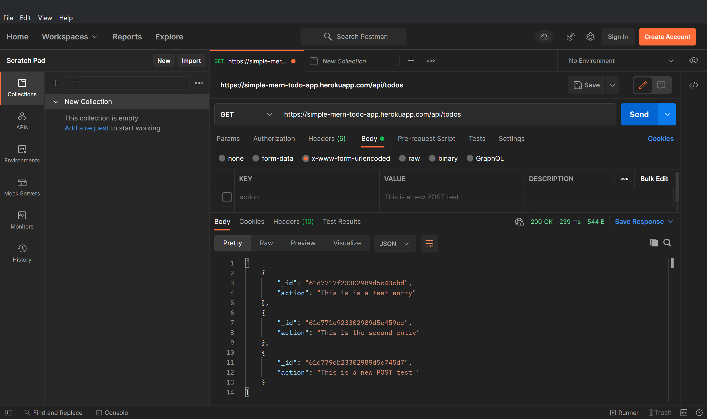

A simple server using MongoDB and ExpressJS
==============
### [Live Endpoint](https://simple-mern-todo-app.herokuapp.com/api/todos) | [Client Repository](https://github.com/Finneasles/simple-mern-todo-app-client)

[](https://heroku.com/deploy) 

---
 
## Prerequisites 
*    [NodeJS](https://nodejs.org/en/)
*    [MongoDB](https://www.mongodb.com/atlas/database)

## Technologies 
*    [Mongoose](https://www.npmjs.com/package/mongoose)
*    [ExpressJS](https://expressjs.com/)


## Tools
*    [Postman](https://www.postman.com/downloads/)


## Setup 
### Install dependencies 
``` bash
$ npm install
```
 
---

## Run the server
To start the server using the following command :

### Development
``` bash
$ npm run dev
```

### Production
``` bash
$ npm start
```

 
---

## Screenshots 


*`GET` data*


*`POST` the entry*


*entry posted*



*`GET` to confirm data entry*

